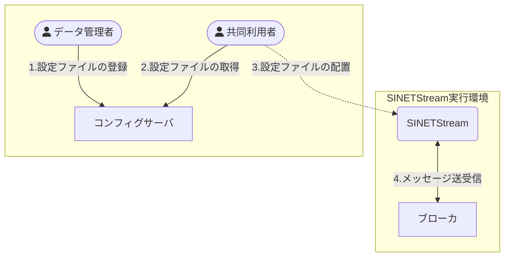
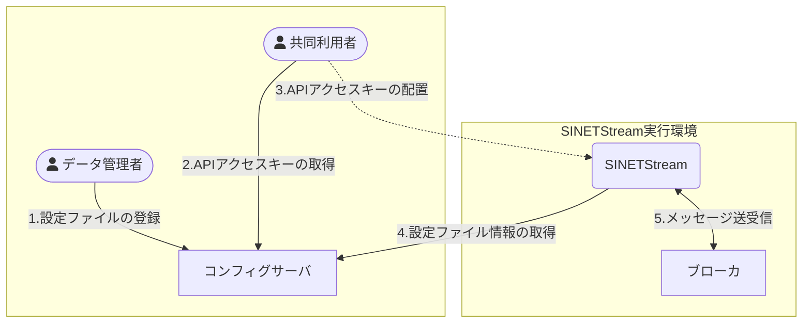

コンフィグサーバの利用シナリオとして、以下に示す２つのケースを想定しています。

1. SINETStream設定ファイルを利用者が配置する場合
1. SINETStreamライブラリがコンフィグサーバから直接情報を取得する場合

それぞれの利用シナリオにおける操作の流れを図示します。

### SINETStream設定ファイルを利用者が配置する場合

### SINETStreamライブラリがコンフィグサーバから直接情報を取得する場合

